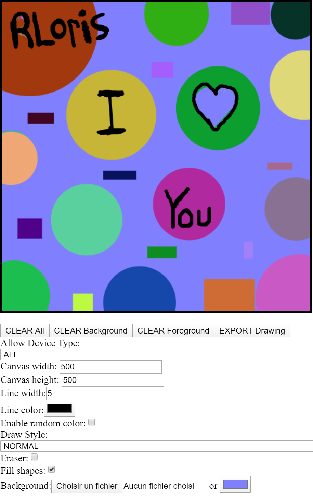

# Ng-Opendraw

Opendraw is an angular component that manipulates the canvas for drawing content across all devices. It supports touch/pen/mouse devices. Built with Angular version 8.2.14.

# NPM

You can integrate opendraw in your project using `npm i ng-opendraw --save`. For more documentation about opendraw check out the readme in the projects/opendraw folder or directly on the npm opendraw page https://www.npmjs.com/package/ng-opendraw.

# Demo OpenDraw

### Draw whatever you want

Signing a document, drawing shapes, freestyle drawing and more...

### Try it out
Try it out here: [DEMO](https://rloris.github.io/lib-ng-opendraw/) or clone this repo and run `ng serve` for a dev server. Navigate to `http://localhost:4200/`. The app will automatically reload if you change any of the source files. You can then test the opendraw library demo.

# License

This project is under the MIT license.

# Author(s)

[RLoris](https://github.com/RLoris)